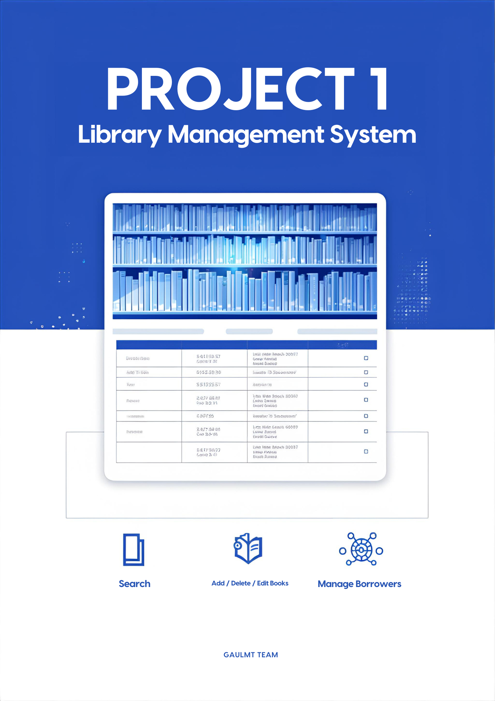
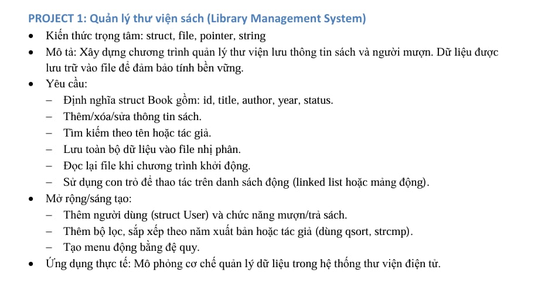

#  PROJECT 1: Quản lý thư viện sách (Library Management System)
 
##  Kiến thức trọng tâm
- `struct`
- `file`
- `pointer`
- `string`

##  Mô tả
Xây dựng chương trình quản lý thư viện lưu thông tin sách và người mượn.  
Dữ liệu được lưu trữ vào file để đảm bảo tính bền vững.

##  Yêu cầu chức năng
 
- Định nghĩa `struct Book` gồm:
  - `id`
  - `title`
  - `author`
  - `year`
  - `status`
- Thêm / xóa / sửa thông tin sách
- Tìm kiếm theo tên hoặc tác giả
- Lưu toàn bộ dữ liệu vào **file nhị phân**
- Đọc lại file khi chương trình khởi động
- Sử dụng **con trỏ** để thao tác trên danh sách động (linked list hoặc mảng động)

##  Mở rộng / Sáng tạo
- Thêm người dùng (`struct User`) và chức năng **mượn/trả sách**
- Thêm bộ lọc, sắp xếp theo **năm xuất bản** hoặc **tác giả** (dùng `qsort`, `strcmp`)
- Tạo **menu động bằng đệ quy**

##  Ứng dụng thực tế
Mô phỏng cơ chế quản lý dữ liệu trong hệ thống **thư viện điện tử**.

## thành viên
- Nguyễn Đăng Dương : Leader
- Mai Ngọc Việt     : Member
- Lê Bá phi         : Member
